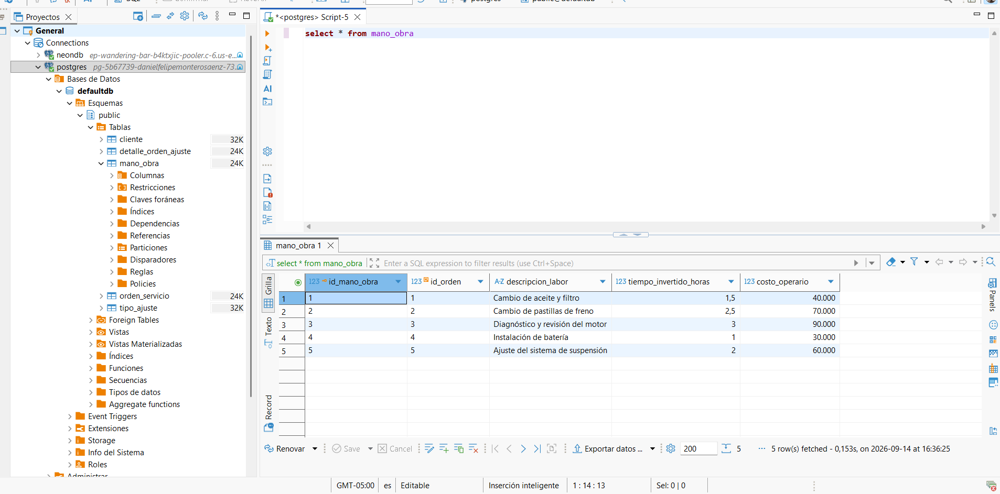
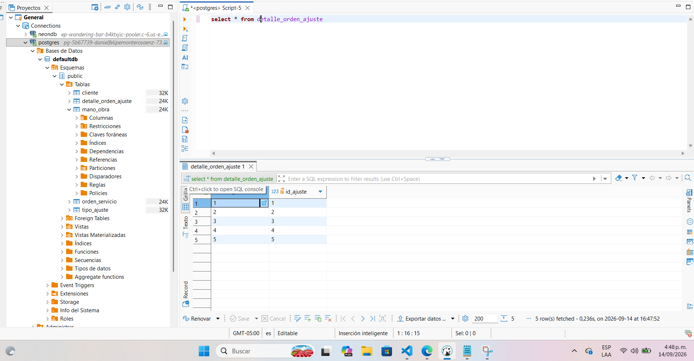
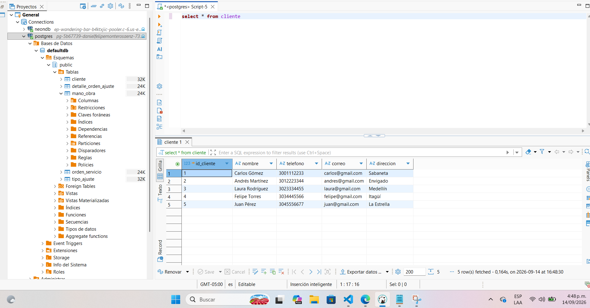
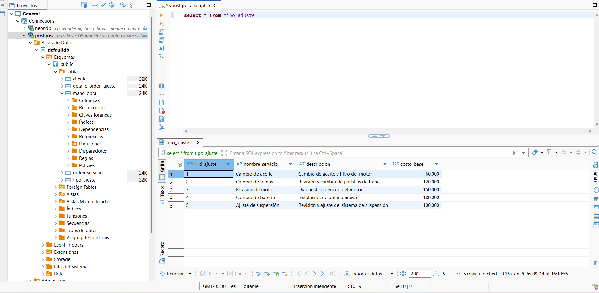
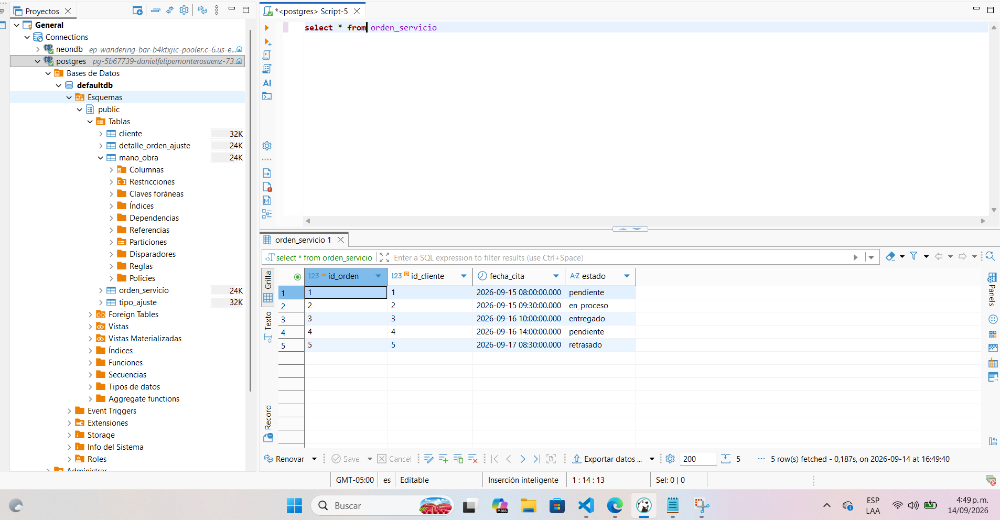

```mermaid
erDiagram
    CLIENTE {
        int id_cliente PK "SERIAL"
        varchar nombre "NOT NULL"
        varchar telefono
        varchar correo
        varchar direccion
    }

    TIPO_AJUSTE {
        int id_ajuste PK "SERIAL"
        varchar nombre_servicio "NOT NULL"
        text descripcion
        numeric costo_base "NOT NULL"
    }

    ORDEN_SERVICIO {
        int id_orden PK "SERIAL"
        int id_cliente FK "NOT NULL"
        timestamp fecha_cita "NOT NULL"
        estado_orden estado "DEFAULT 'pendiente'"
    }

    DETALLE_ORDEN_AJUSTE {
        int id_orden PK,FK "NOT NULL"
        int id_ajuste PK,FK "NOT NULL"
    }

    MANO_OBRA {
        int id_mano_obra PK "SERIAL"
        int id_orden FK "NOT NULL"
        varchar descripcion_labor "NOT NULL"
        numeric tiempo_invertido_horas "NOT NULL"
        numeric costo_operario "NOT NULL"
    }

    CLIENTE ||--o{ ORDEN_SERVICIO : "realiza"
    ORDEN_SERVICIO ||--o{ DETALLE_ORDEN_AJUSTE : "contiene"
    TIPO_AJUSTE ||--o{ DETALLE_ORDEN_AJUSTE : "aplica_en"
    ORDEN_SERVICIO ||--o{ MANO_OBRA : "registra"

    
    
    
    
    